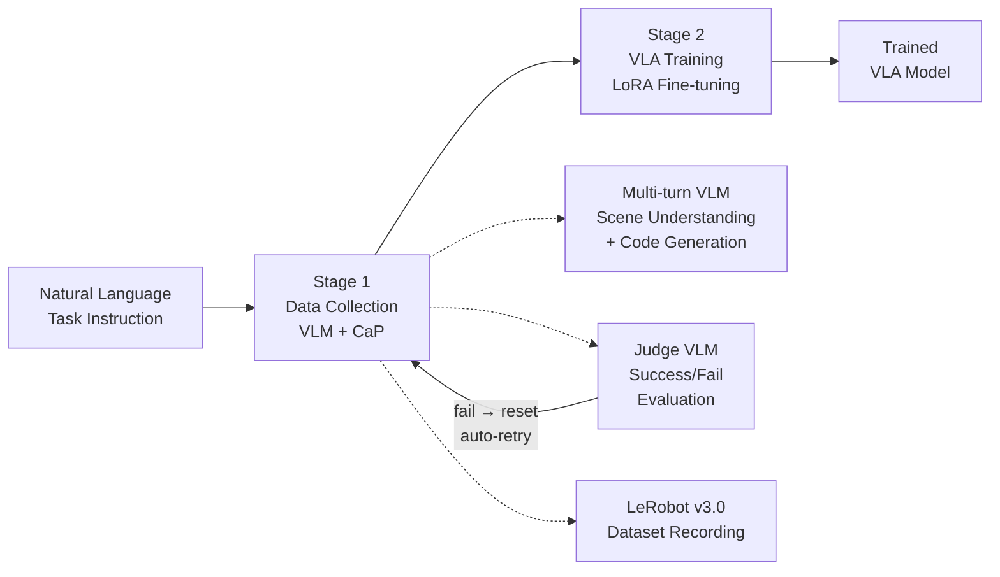

# RealWorld-DataCollector-Framework (ACS)

<p align="center">
  <a href="https://skku-prism.github.io/rapid-project/">
    
  </a>
</p>

<p align="center">
  <a href="https://skku-prism.github.io/rapid-project/"></a>
</p>

---

<p align="center">
  <a href="LICENSE"></a>
  <a href="https://www.python.org/"></a>
  <a href="https://developer.nvidia.com/cuda-toolkit"></a>
  <a href="Dockerfile"></a>
  <a href="https://ai.google.dev/"></a>
  <a href="https://github.com/huggingface/lerobot"></a>
  <a href="https://github.com/NVIDIA/GR00T"></a>
</p>

An end-to-end real-world robotics framework that autonomously collects manipulation demonstrations using VLM-guided Code-as-Policies, then trains Vision-Language-Action (VLA) models via LoRA fine-tuning — all from a single command.

```bash
git clone https://github.com/SKKU-PRISM/RealWorld-DataCollector-Framework.git && cd RealWorld-DataCollector-Framework
docker build -t acs .
docker run --gpus all -e GOOGLE_API_KEY="your-key" acs
```

---

## Pipeline Overview



| Stage | What It Does | Key Technology |
|---|---|---|
| **1. Data Collection** | VLM observes workspace, generates executable Python code, robot executes manipulation, Judge evaluates success/failure, auto-reset and repeat | Gemini VLM multi-turn + Pinocchio IK + Forward-Reset loop + LeRobot recording |
| **2. VLA Training** | Fine-tune VLA model (GR00T, SmolVLA, PI0.5) on collected demonstrations via LoRA adapters | HuggingFace PEFT + LoRA + multi-task training |

---

## Architecture

```
┌──────────────────────────────────────────────────────────────────┐
│                    Natural Language Instruction                   │
│              "pick up the red block and place it on              │
│                        the blue dish"                             │
└─────────────────────────┬────────────────────────────────────────┘
                          │
          ┌───────────────▼───────────────┐
          │   STAGE 1: AutoDataCollector   │
          │         (collector/)           │
          │                                │
          │  ┌────────────────────────┐    │
          │  │ VLM Multi-turn (Gemini)│    │
          │  │  Turn 0: Scene Under.  │    │
          │  │  Turn 1: Object Detect │    │
          │  │  Turn 2: Grasp Point   │    │
          │  │  Turn 3: Code Gen      │    │
          │  └───────────┬────────────┘    │
          │              │                 │
          │  ┌───────────▼────────────┐    │
          │  │ SO-101 Robot Execution │    │
          │  │  Pinocchio IK + Skills │    │
          │  └───────────┬────────────┘    │
          │              │                 │
          │  ┌───────────▼────────────┐    │
          │  │ Judge VLM Evaluation   │    │
          │  │  Success → Record      │    │
          │  │  Fail    → Reset+Retry │    │
          │  └───────────┬────────────┘    │
          │              │                 │
          │  ┌───────────▼────────────┐    │
          │  │ LeRobot v3.0 Dataset   │    │
          │  │  Multi-cam + Skills    │    │
          │  └────────────────────────┘    │
          └───────────────┬────────────────┘
                          │
          ┌───────────────▼───────────────┐
          │    STAGE 2: RoboBridge         │
          │         (bridge/)              │
          │                                │
          │  ┌────────────────────────┐    │
          │  │ VLA LoRA Fine-tuning   │    │
          │  │  GR00T N1.5 / SmolVLA  │    │
          │  │  PI0.5                 │    │
          │  └───────────┬────────────┘    │
          │              │                 │
          │  ┌───────────▼────────────┐    │
          │  │ Trained LoRA Adapter   │    │
          │  │  Move + Grip adapters  │    │
          │  └────────────────────────┘    │
          └────────────────────────────────┘
```

---

## Quick Start

### 1. Installation

```bash
git clone https://github.com/SKKU-PRISM/RealWorld-DataCollector-Framework.git
cd RealWorld-DataCollector-Framework
```

### 2. Run

```bash
# Full pipeline (collect → train)
GOOGLE_API_KEY="your-key" ./run_agent.sh

# Data collection only
GOOGLE_API_KEY="your-key" ./run_agent.sh --stage collect

# VLA training only
./run_agent.sh --stage train
```

### 3. Run with Docker

```bash
docker build -t acs .

docker run --rm --gpus all \
    -v $(pwd)/outputs:/app/outputs \
    -e GOOGLE_API_KEY="your-key" \
    acs

# Training only
docker run --rm --gpus all \
    -v $(pwd)/outputs:/app/outputs \
    acs ./run_agent.sh --stage train

# Interactive shell
docker run --rm --gpus all -it \
    -e GOOGLE_API_KEY="your-key" \
    acs /bin/bash
```

### 4. Configuration via Environment Variables

#### Data Collection

| Variable | Description | Default |
|---|---|---|
| `GOOGLE_API_KEY` | Gemini API key (required for collection) | - |
| `INSTRUCTION` | Task instruction in natural language | `pick up the red block...` |
| `ROBOT_IDS` | Robot IDs to use | `2 3` |
| `NUM_EPISODES` | Number of episodes to collect | `30` |
| `MULTI_TURN` | Enable VLM multi-turn code generation | `true` |

#### VLA Training

| Variable | Description | Default |
|---|---|---|
| `TRAIN_MODEL_BACKEND` | VLA model backend | `groot_n1.5` |
| `TRAIN_LR` | Learning rate | `5e-5` |
| `TRAIN_EPOCHS` | Training epochs | `500` |
| `TRAIN_BATCH_SIZE` | Micro batch size | `2` |
| `TRAIN_GRAD_ACCUM` | Gradient accumulation steps | `16` |
| `TRAIN_LORA_RANK` | LoRA rank | `64` |

---

## Supported VLA Models

| Model | HuggingFace ID | Parameters | Chunk Size | Training Time (A100) |
|---|---|---|---|---|
| **GR00T N1.5** | `nvidia/GR00T-N1.5-3B` | ~3B | 16 | ~23h |
| **SmolVLA** | `lerobot/smolvla_base` | ~500M | 50 | ~2.7h |
| **PI0.5** | `lerobot/pi05_base` | ~3B | 50 | ~11h |

## Hardware

| Component | Model | Qty | Purpose |
|---|---|---|---|
| Robot Arm | SO-101 (Feetech STS3215, 6DOF) | 2 | Manipulation |
| Top Camera | Intel RealSense D435 | 1 | RGB-D workspace view |
| Wrist Camera | Innomaker U20CAM (OpenCV) | 2 | Per-arm wrist view |
| GPU | NVIDIA (CUDA 12.1+) | 1 | VLA training & inference |

---

## Project Structure

```
RealWorld-DataCollector-Framework/
├── Dockerfile                  # Docker image build configuration
├── run_agent.sh                # Main entry point (collect → train)
├── .dockerignore               # Docker build exclusions
├── pyproject.toml              # Python package configuration
├── requirements.docker.txt     # Bridge dependencies
│
├── collector/                  # Stage 1: AutoDataCollector
│   ├── execution_forward_and_reset.py  # Main pipeline entry point
│   ├── run_forward_and_reset.sh        # Shell runner with config
│   ├── code_gen_lerobot/       # VLM multi-turn code generation
│   │   ├── forward_execution/  # Forward task prompts
│   │   ├── reset_execution/    # Reset task prompts
│   │   ├── multi_arm/          # Multi-arm prompts
│   │   └── llm_utils/          # LLM API clients (Gemini, OpenAI, vLLM)
│   ├── skills/                 # Robot skill primitives (pick, place, push...)
│   ├── src/lerobot_cap/        # Low-level control (IK, FK, motor, safety)
│   ├── record_dataset/         # LeRobot v3.0 dataset recording
│   ├── judge/                  # VLM success/failure evaluation
│   ├── verification/           # LLM code pre-verification
│   ├── object_detection/       # Grounding DINO object detection
│   ├── cameras/                # Camera managers (OpenCV, RealSense)
│   ├── pipeline/               # Pipeline infrastructure
│   ├── robot_configs/          # Robot YAML configs + calibration data
│   ├── pipeline_config/        # API & recording configs
│   ├── assets/urdf/            # Robot URDF models
│   ├── scripts/                # Training & verification scripts
│   └── lerobot/                # HuggingFace LeRobot bundle (git-ignored)
│
├── bridge/                     # Stage 2: RoboBridge
│   ├── src/robobridge/         # Core framework
│   │   ├── core/               # Orchestrator + adapters
│   │   ├── modules/            # Perception, Planner, Controller, Robot, Monitor
│   │   ├── wrappers/           # Custom model wrappers
│   │   └── client/             # High-level API client
│   ├── multitask_training_package/  # Multi-task VLA training
│   │   ├── train_lora.py       # Main LoRA training script
│   │   ├── configs/            # Training configs (per-model, per-task)
│   │   └── data/               # Normalization metadata
│   ├── scripts/
│   │   ├── train/              # Training scripts
│   │   ├── eval/               # Evaluation scripts (RoboCasa, SO-101, LIBERO)
│   │   ├── preprocess/         # Data preprocessing (HDF5 → NPZ)
│   │   └── so101/              # SO-101 server/client for real robot
│   └── configs/                # Base + model-specific YAML configs
│
├── examples/                   # Demo data + scripts
│   ├── demo_data/              # RoboCasa CloseDrawer sample (~13MB)
│   └── train_eval_demo.sh      # One-command train + eval demo
│
├── pipeline/                   # Cross-module utilities
├── configs/                    # Global configs
└── scripts/                    # Helper scripts
```

---

## Quick Demo: Training + Evaluation

The `examples/` directory includes real RoboCasa CloseDrawer demonstration data (~13MB), allowing you to test the full training and evaluation pipeline immediately after cloning.

### 1. Run Training + Evaluation

```bash
# Activate environment
conda activate robobridge

# Train (20 steps) + RoboCasa evaluation
./examples/train_eval_demo.sh

# Training only
./examples/train_eval_demo.sh --train

# Evaluation only (requires trained adapter)
./examples/train_eval_demo.sh --eval
```

### 2. Demo Data Structure

```
examples/demo_data/
├── metadata.json               # Action normalization statistics
├── metadata_extended.json      # State statistics (for GROOT/SmolVLA/PI0.5)
├── train/
│   ├── CloseDrawer_demo32.npz  # Images (128x128) + state (12D) + action (7D)
│   ├── CloseDrawer_demo32.json # Instruction + task metadata
│   ├── CloseDrawer_demo47.npz
│   └── CloseDrawer_demo47.json
└── val/
    ├── CloseDrawer_demo20.npz
    └── CloseDrawer_demo20.json
```

### 3. Installing RoboCasa / LIBERO for Simulation Evaluation

To run simulation-based evaluation, RoboCasa and LIBERO must be installed separately.

```bash
# MuJoCo (required)
pip install mujoco==3.3.1

# robosuite (RoboCasa-compatible fork)
git clone https://github.com/robocasa/robosuite.git
cd robosuite && pip install -e . && cd ..

# RoboCasa
git clone https://github.com/robocasa/robocasa.git
cd robocasa && pip install -e . && cd ..

# Download RoboCasa kitchen assets
python -m robocasa.scripts.download_kitchen_assets

# (Optional) LIBERO
git clone https://github.com/Lifelong-Robot-Learning/LIBERO.git
cd LIBERO && pip install -e . && cd ..
```

### 4. Training with Custom Data

To train with your own data, prepare NPZ files in the same format:

```bash
# Override training settings via environment variables
TRAIN_MODEL_BACKEND=groot_n1.5 \
TRAIN_EPOCHS=500 \
TRAIN_LORA_RANK=64 \
TRAIN_BATCH_SIZE=2 \
TRAIN_GRAD_ACCUM=16 \
./run_agent.sh --stage train
```

---

## Documentation

| Document | Description |
|---|---|
| [collector/README.md](collector/README.md) | AutoDataCollector setup and usage |
| [bridge/README.md](bridge/README.md) | RoboBridge framework and API |
| [DOCKER_INTEGRATION_CHECKLIST.md](collector/DOCKER_INTEGRATION_CHECKLIST.md) | Docker submission checklist |

## Notes

- API keys are **never** hardcoded in the image. Always inject via `-e` flags at runtime.
- `collector/lerobot/` (LeRobot bundle) is git-ignored but included in the Docker image for training.
- Training outputs are saved to `outputs/vla_adapters/`. Mount `-v` to persist across containers.
- The IK engine uses [Pinocchio](https://github.com/stack-of-tasks/pinocchio) installed via conda-forge.

---

<p align="center">
  <b>SKKU PRISM Lab</b> | Sungkyunkwan University
</p>
