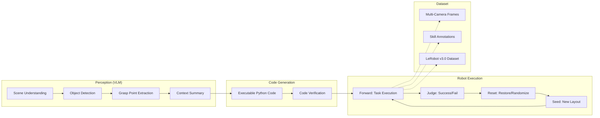

<p align="center">
  
</p>

<h3 align="center">Automated Robot Manipulation Data Factory</h3>

<p align="center">
  VLM-driven code generation + autonomous execution + automatic dataset recording<br>
  for scalable Vision-Language-Action (VLA) model training
</p>

<p align="center">
  
  
  
  
</p>

---

## Demo

<!-- Replace with actual demo GIF/video -->
<p align="center">
  
</p>

---

## Key Features

- **VLM Multi-Turn Code Generation** — Scene understanding → object detection → grasp point extraction → executable code, all via VLM
- **Forward-Reset Autonomous Loop** — Task execution → automatic reset → repeat, no human intervention
- **Multi-Arm Coordination** — Bi-arm workspace partitioning, parallel operation, handover support
- **Seed-Based Randomization** — Auto-generate diverse initial object layouts within workspace constraints
- **LeRobot Dataset Recording** — Multi-camera frames + skill annotations + subtask labels, ready for VLA training

---

## Architecture



---

## Pipeline Flow

```
Seed Setup (random object placement)
    │
    ▼
┌─────────────────────────────────────────────┐
│  Forward Execution                          │
│  VLM Codegen → Robot executes task          │
│  Multi-camera recording throughout          │
├─────────────────────────────────────────────┤
│  Judge                                      │
│  VLM evaluates success (TRUE/FALSE)         │
├─────────────────────────────────────────────┤
│  Reset Execution                            │
│  VLM Codegen → Restore or randomize layout  │
│  Multi-camera recording throughout          │
└──────────────────────┬──────────────────────┘
                       │
                       ▼
                 Next Episode
```

Each episode produces a complete LeRobot dataset with synchronized multi-camera frames, joint states, and hierarchical skill/subtask annotations.

---

## Quick Start

```bash
# 1. Clone & install
git clone https://github.com/SKKU-PRISM/AutoDataCollector.git
cd AutoDataCollector
pip install -e ".[all]"
conda install -c conda-forge pinocchio

# 2. Configure
cp pipeline_config/paid_api_config.yaml.example pipeline_config/paid_api_config.yaml
# Edit: set your Gemini API key, robot IDs, camera devices

# 3. Run
bash run_forward_and_reset.sh
```

---

## Module Overview

| Module | Path | Role |
|--------|------|------|
| **VLM Codegen** | `code_gen_lerobot/` | Multi-turn VLM pipeline (perception → code generation) |
| **Skills API** | `skills/` | Robot primitives — pick, place, move, gripper control |
| **Multi-Arm** | `unified_multi_arm.py` | Bi-arm orchestration, workspace partitioning |
| **Recording** | `record_dataset/` | LeRobot v3.0 dataset writer with multi-camera sync |
| **Verification** | `verification/` | LLM-based pre-execution code validation |
| **Low-Level** | `src/lerobot_cap/` | IK/FK (Pinocchio), trajectory planning, motor control |
| **Workspace** | `code_gen_lerobot/reset_execution/workspace.py` | Reachability validation, collision checking, seed generation |
| **Pipeline** | `pipeline/` | TaskRunner, camera management, base pipeline |

---

## Hardware

| Component | Model | Qty | Purpose |
|-----------|-------|-----|---------|
| Robot Arm | SO-101 (Feetech STS3215) | 2 | 6-DOF manipulation |
| Top Camera | Intel RealSense D435 | 1 | RGB-D workspace view |
| Wrist Camera | Innomaker U20CAM | 2 | Per-arm wrist view |
| GPU | NVIDIA (CUDA) | 1 | VLM inference (optional, API-based) |

---

## Project Structure

```
AutoDataCollector/
├── execution_forward_and_reset.py  # Main entry point
├── unified_multi_arm.py            # Multi-arm pipeline
├── code_gen_lerobot/               # VLM codegen pipeline
│   ├── forward_execution/          #   Forward task prompts
│   ├── reset_execution/            #   Reset task prompts + workspace
│   └── multi_arm/                  #   Multi-arm specific prompts
├── skills/                         # Robot skill primitives
├── record_dataset/                 # LeRobot dataset recording
├── verification/                   # Code verification module
├── pipeline/                       # Pipeline infrastructure
├── cameras/                        # Camera drivers (OpenCV, RealSense)
├── src/lerobot_cap/                # Low-level control
│   ├── hardware/                   #   Motor controllers (Feetech)
│   ├── kinematics/                 #   FK/IK engine (Pinocchio)
│   └── planning/                   #   Trajectory planning
├── robot_configs/                  # Robot YAML configs, calibration
├── pipeline_config/                # Pipeline YAML configs
└── assets/urdf/                    # Robot URDF models
```

---

## License

MIT License

---

<p align="center">
  <b>SKKU PRISM Lab</b>
</p>
